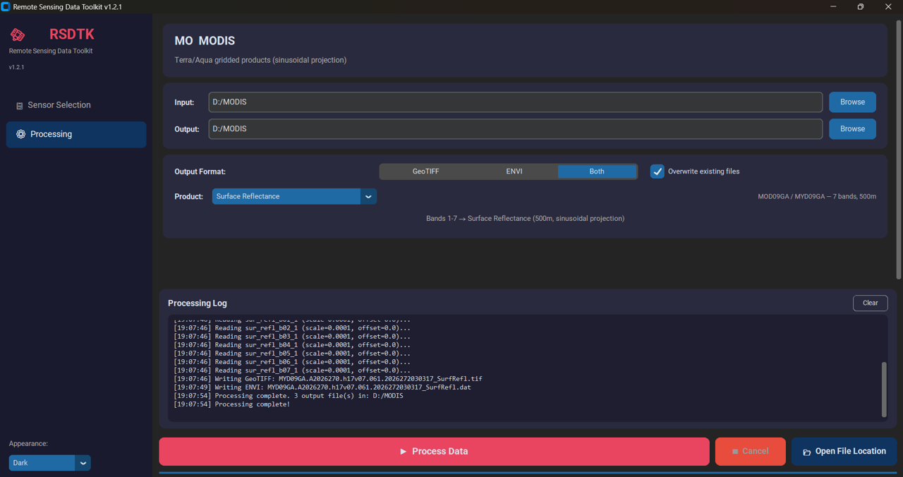

# RSDTK — Remote Sensing Data Toolkit

[](LICENSE)
<!-- Add after first Zenodo release: -->
<!-- [](https://doi.org/10.5281/zenodo.XXXXXXX) -->

A desktop application for batch converting satellite and airborne remote sensing
data into analysis-ready GeoTIFF and ENVI formats.

RSDTK handles the preprocessing that stands between a downloaded granule and
usable imagery: merging single-band files, applying per-product calibration and
scaling factors, orthorectifying and reprojecting swath data, subsetting
spatially and spectrally, and writing standardized outputs with correct
georeferencing and wavelength metadata.

**14 sensor families. 30+ product types. One interface.**

<!-- TODO: add screenshot -->
<!--  -->

---

## Why RSDTK

Multi-sensor remote sensing work involves a disproportionate amount of file
handling. Every mission has its own conventions for band layout, scaling
factors, fill values, geolocation, and projection, and those conventions change
between product collections. A study comparing thermal data across ASTER,
ECOSTRESS, Landsat, and MODIS requires four different preprocessing pipelines
before any science can begin.

RSDTK absorbs that variability. The intent is that sensor selection becomes a
scientific decision rather than a question of which format you have the patience
to wrangle.

### Relationship to other tools

For gridded NASA satellite products with straightforward subsetting needs,
[AppEEARS](https://appeears.earthdatacloud.nasa.gov/) is often the better
choice: it is server-side, requires no installation, and handles quality
filtering well.

RSDTK covers ground AppEEARS does not:

- **Airborne sensors** — MASTER, HyTES, AVIRIS-3/5, AVIRIS-NG, and Classic
  AVIRIS are not in the DAAC gridded archives.
- **ENVI output with wavelength metadata** — required for spectral analysis in
  ENVI and IVIS Plot.
- **Cross-sensor spectral resampling** — convolve hyperspectral data to another
  sensor's band positions.
- **Raw swath reprojection** — ECOSTRESS L2, Sentinel-3, and AIRS from swath
  geometry rather than pre-gridded products.
- **Non-NASA data** — ESA Sentinel-2 and Sentinel-3.
- **Local batch processing** — no queues, request limits, or service dependency.

---

## Supported sensors and products

> **Testing status.** Products marked ✅ have been verified against real
> granules during development. Automated tests are not yet in place, so please
> [open an issue](../../issues) if you hit a problem with any of them.

### Spaceborne multispectral

| Sensor | Products | Notes | Status |
|---|---|---|---|
| **ASTER V004** | AST_05, AST_07, AST_07XT, AST_08, AST_09T, AST_L1T | GeoTIFF; per-product scaling | ✅ |
| **ASTER V003** | AST_05, AST_07, AST_08, AST_09T, AST_07M | HDF4; geolocation from tie points / sidecar metadata. AST_07M merges VNIR+SWIR to 9 bands at 30 m | ✅ |
| **Landsat L1** | OLI/TIRS (L8–9), ETM+ (L7), TM (L4–5), MSS (L1–5) | Mission auto-detected from MTL | ✅ |
| **Landsat L2** | Surface reflectance, surface temperature, ST ancillary | L8–9, L7, L4–5 | ✅ |
| **Sentinel-2** | L2A surface reflectance (R10m, R20m, SCL) | SAFE format | ✅ |
| **Sentinel-3** | SLSTR L1B RBT, SLSTR L2 LST, OLCI L1B EFR, Synergy L2 SYN | KD-tree swath reprojection | ✅ |
| **ECOSTRESS** | L1CT radiance, L2 LSTE (LST, emissivity, QA) | L2 reprojected from swath | ✅ |
| **VIIRS** | VNP02IMG, VNP02MOD, VNP21 | Requires matching VNP03 geolocation for 02IMG/02MOD | ✅ |
| **MODIS** | MOD09GA/MYD09GA, MOD11A1/MYD11A1 | Native sinusoidal projection retained | ✅ |

### Spaceborne hyperspectral

| Sensor | Products | Notes | Status |
|---|---|---|---|
| **EMIT** | L2A surface reflectance (285 bands, 380–2500 nm) | GLT orthorectification | ✅ |
| **AIRS** | L1B radiance (2378 channels, 3.7–15.4 µm) | KD-tree reprojection | ✅ |

### Airborne

| Sensor | Products | Notes | Status |
|---|---|---|---|
| **MASTER** | L1B radiance (50 bands), L2 emissivity/LST | Optional VSWIR → TOA reflectance | ✅ |
| **HyTES** | L1 radiance (256 bands, 7.5–12 µm), L2 emissivity/LST | Optional PC emissivity | ✅ |
| **AVIRIS-3/5** | L1B radiance, L2A surface reflectance | AV3/AV5 auto-detected; GLT orthorectification | ✅ |
| **AVIRIS-NG** | L1B radiance (425 bands), L2 reflectance | Orthorectified ENVI input | ✅ |
| **Classic AVIRIS** | L1B radiance (224 bands), L2 reflectance | Orthorectified ENVI input | ✅ |

---

## Installation

### Windows installer (recommended for most users)

Download `RSDTK_v1.2_Setup.exe` from the
[latest release](../../releases/latest) and run it. Nothing else is required —
Python and all dependencies are bundled.

### From source (Windows, macOS, Linux)

Requires Python 3.10 or later.

```bash
git clone https://github.com/<ORG>/RSDTK.git
cd RSDTK

# conda (recommended — GDAL and pyhdf install more reliably)
conda env create -f environment.yml
conda activate rsdtk

# or pip
pip install -r requirements.txt

python RSDTK.py
```

> **Note on platform support.** RSDTK is developed and routinely used on
> Windows. The source install is expected to work on macOS and Linux but is not
> yet systematically tested there. Reports from other platforms are very
> welcome.

---

## Quick start

1. Launch RSDTK.
2. Pick a sensor from the left panel. For sensors with several products, choose
   from the product dropdown.
3. Set the **input folder** to wherever the raw granules live. Both layouts work:
   one subfolder per granule as downloaded, or all files flat in one folder
   (RSDTK groups them by granule ID).
4. Optionally set an output folder. The default is `<input>/converted/`.
5. Choose GeoTIFF, ENVI, or both.
6. Optionally set a bounding box and/or spectral subset.
7. Click **Process Data**.

Outputs are written to `GeoTIFF/` and `ENVI/` subfolders automatically.

Every converter also runs standalone from the command line:

```bash
python EMIT_L2A_Converter.py /path/to/data --match-sensor landsat --envi
python ECOSTRESS_L2_Converter.py /path/to/data --bbox -15.5 -14.0 165.0 167.5
python AIRS_L1B_Converter.py /path/to/data --every-nth 10
```

Run any converter without arguments to see its options.

---

## Key features

**Spatial subsetting.** Bounding box by manual coordinates or from a shapefile,
KML, or GeoJSON. Clips the output grid before processing, so it reduces
processing time as well as file size. Available for ECOSTRESS, EMIT, AVIRIS-3/5,
AVIRIS-NG, Classic AVIRIS, Sentinel-3, MASTER, HyTES, and AIRS.

**Spectral subsetting.** Every Nth band, explicit wavelength ranges, named
regions (VNIR, SWIR, VIS, NIR), or resampling to match Landsat, Sentinel-2,
ASTER, or MODIS band positions via Gaussian convolution or nearest-band
selection. Available for all hyperspectral and multi-band airborne sensors.

**Correct fill-value handling.** NaN for GeoTIFF, −9999 for ENVI. Zeros are
never used as fill, which otherwise produces spurious index values such as
NDVI = 1.

**ENVI headers with wavelength metadata.** Written directly rather than through
GDAL's ENVI driver, so wavelength and FWHM arrays survive intact for spectral
analysis.

**Batch processing.** One bounding box and one spectral selection applied
consistently across every granule in a folder, which is what makes time-series
work over a single target practical.

---

## Documentation

The full user guide is in [`docs/`](docs/), covering every sensor, product,
and option in detail, including expected input folder structures.

---

## Citing RSDTK

If RSDTK contributes to published work, please cite it. See
[`CITATION.cff`](CITATION.cff), or use the "Cite this repository" button in the
sidebar.

---

## Contributing

Bug reports, sensor requests, and pull requests are all welcome. See
[`CONTRIBUTING.md`](CONTRIBUTING.md).

Planned work and known gaps are tracked in [`ROADMAP.md`](ROADMAP.md). If a
sensor or product you need is missing, please open an issue — priorities are
driven substantially by what people actually ask for.

---

## License

MIT — see [`LICENSE`](LICENSE). Bundled third-party components in the Windows
installer are listed in [`THIRD_PARTY_LICENSES.md`](THIRD_PARTY_LICENSES.md).

---

## Acknowledgments

Developed at the University of Pittsburgh, Department of Geology &
Environmental Science.

Built on [rasterio](https://rasterio.readthedocs.io/),
[GDAL](https://gdal.org/), [NumPy](https://numpy.org/),
[SciPy](https://scipy.org/), [pyproj](https://pyproj4.github.io/pyproj/),
[netCDF4](https://unidata.github.io/netcdf4-python/),
[h5py](https://www.h5py.org/), [pyhdf](https://hdfeos.org/software/pyhdf.php),
and [CustomTkinter](https://customtkinter.tomschimansky.com/).
